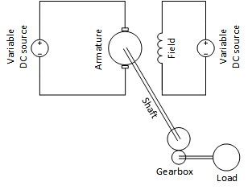

# Project-1: Modeling a DC-motor drive system

## Definition

In this project, you will be dealing with:

* Modeling a DC motor drive system using various techniques
* Building a simple DC motor drive on your own
* Analyzing of the electrical and mechanical characteristics

You may investigate the models you find on the internet, however the model that you will build and your results should be **completely on your OWN**.

Please see the motor ratings and other parameters assigned to you. The motor drive system that you will model is shown in Fig. 1.

Fig. 1: The DC-motor drive system

## Project Content

#### Part A: Modeling

Obtain the **analytical model** of this system using pen&paper, (you do not need include it in the project report, but you will use this model in the next parts). The content of your model will include, but not limited to, terminal voltage equation, back emf equation, torque balance, acceleration equation etc.

I. Construct a model of this system using **simple Simulink blocks**, such as constant, product, sum, gain, integrator etc. In this part, you are not allowed to use any electrical equipment blocks, SimScape, and SimPowerSystem toolbox.

II. Construct a model of this system using only **voltage or current sources** (dependent or independent), and **passive elements** (resistors, inductors and capacitors). In this part, you will use SimPowerSystem toolbox, but not use the DC motor block.

III. Construct a model of this system using the **DC motor** block and other blocks in the SimPowerSystem, and SimScape toolbox.

#### Part B: Analysis

You will analyze three models that you have constructed using the conditions given below. First make sure, all three models' results are consistent with each other. Plot the following and comment on the variation of each variable, and explain as detailed as possible.

1. Apply rated voltages to both armature and field winding (if applicable). Obtain the following variations against time. Make sure that the system reaches the steady state. 

   * Motor speed and torque
   * Back-emf voltage and current
   * Motor torque and load torque
   * Motor speed and load speed
   * Overall system efficiency

2. Decrease the armature voltage to its 50% when the system is operating at its steady state at the rated values. 

   *	Motor speed and torque
   *	Armature voltage, current and electric power (comment on the operating mode)
   *	Motor torque and load torque
   *	Motor speed and load speed

3. Design a voltage controller such that the start-up armature current never exceeds 150% of its rated value (use a simple controlled voltage source, do not use power electronic circuits yet in this project).

   *  Motor speed and torque
   *  Armature voltage and current

#### Part C: Comments
1.

## Deadline:
27/03/2017 23:59

## HINTS:

* When constructing the models, go **step-by-step**. Do not try to implement the whole model at once, expect it to work without any problems.
* Always be aware to use **correct units**.
* Understand the **analytical model** before constructing the models.
* If you have any problems with your models, you can always [open an issue in GitHub](https://guides.github.com/features/issues/) for online feedback, or visit the course assistant in the office hours.

## Submission

You have to submit at least the following two files:

- The Simulink models
- A report describing your models in detail, with the parts explained below:

Your report should include:
-
-

<!--- Hazır motor dataları
http://w3app.siemens.com/mcms/infocenter/dokumentencenter/ld/Documentsu20Catalogs/dc-motor/da12-2008-en.pdf
http://ecatalog.weg.net/files/wegnet/WEG-specification-of-electric-motors-50039409-manual-english.pdf
http://www.maxonmotor.com/maxon/view/category/motor?target=filter&filterCategory=DC-max
http://www.kollmorgen.com/en-us/products/motors/brush-dc/permanent-magnet-dc-pmdc/
http://www.moog.com/literature/MCG/moc23series.pdf
-->
